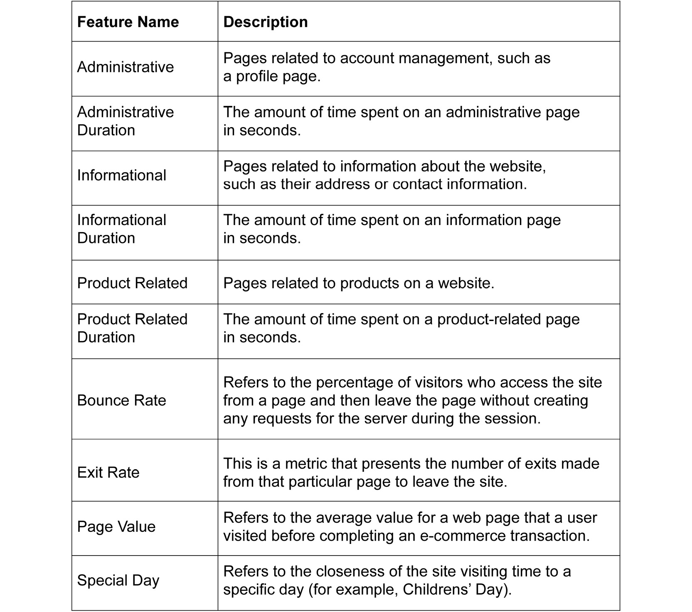
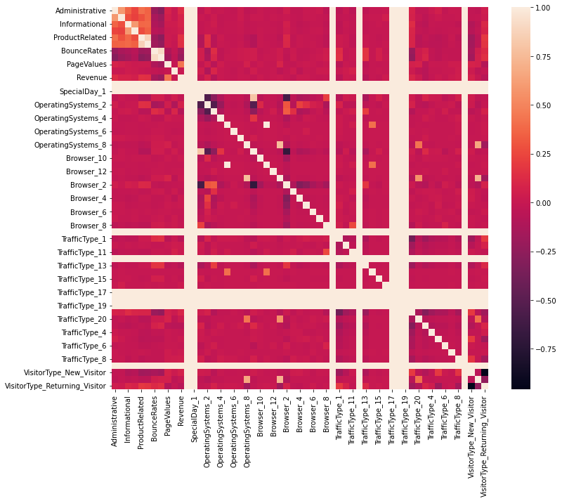
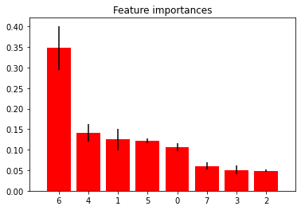
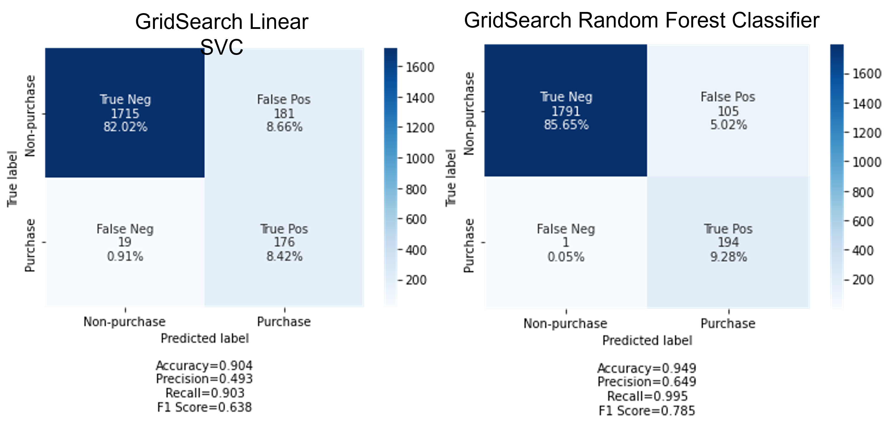
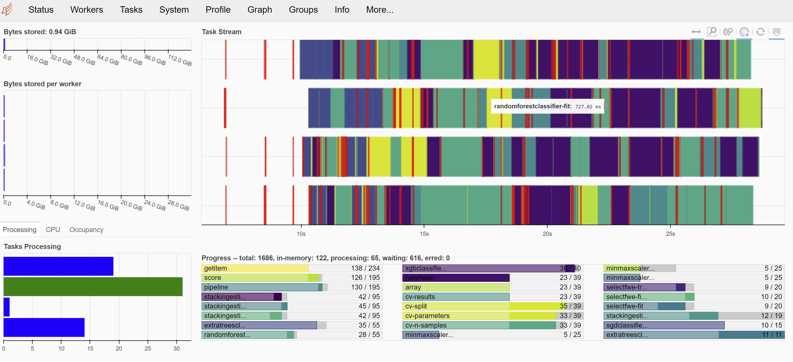
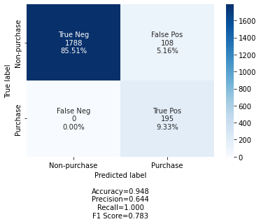
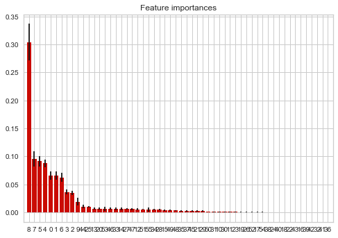
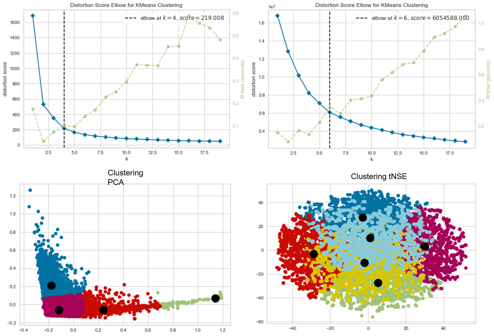
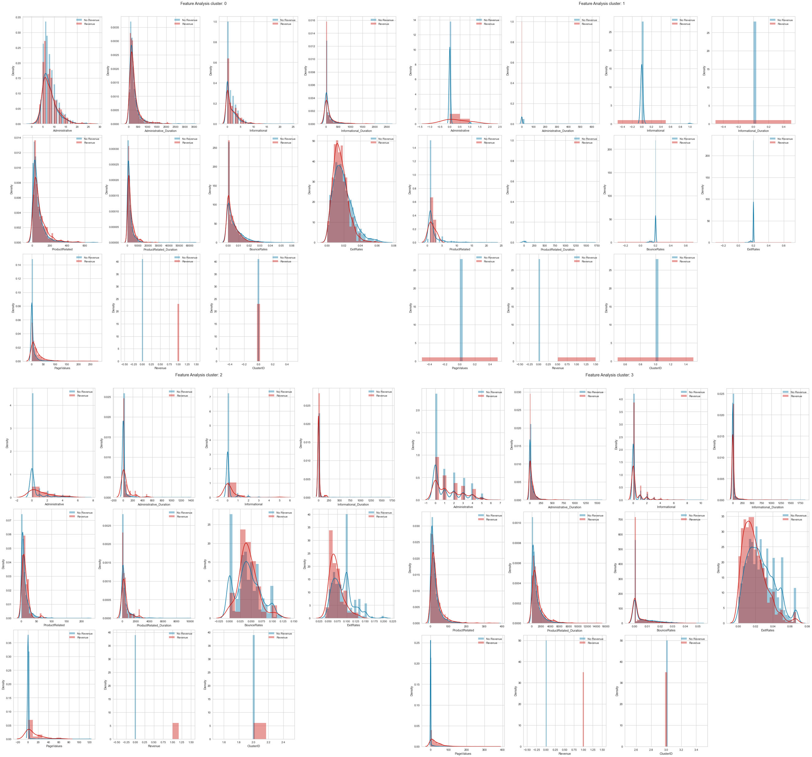
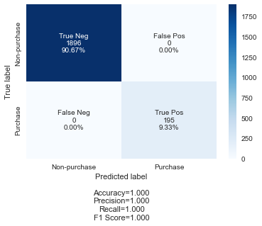

# Online-Shoppers-Purchasing-Intention
Data Science Assignment to aid complete analysis of online Shopping behavior
---

# Background:
The goal is to develop Machine Learning Models to present a complete analysis for online shopping behavior data set.
We will:
1. Build a predictive classification model (ensuring optimal features and classifier). Train the model on data entries corresponding to the months of June-Dec, and test the model on data entries corresponding to Feb-March.
2. Generate user-bahavior clusters based on the purchasing behavior data for the complete dataset.
3. Build a semi-supervised self labelling model to estimate 'Revenue' for the missing records and then fit our classifier. We will assume that for all records from Oct-Dec, the 'Revenue' attribute is missing. 

# Method:
## Dataset:
The data set is from "Online Shoppers Purchasing Intention Dataset Data Set" https://archive.ics.uci.edu/ml/datasets/Online+Shoppers+Purchasing+Intention+Dataset

The goal is to develop Machine Learning Models to present a complete analysis for online shopping behavior data set.
Description of data set:
The data set is "online_shoppers_intention.csv". This data set represents skewed data, such that 84.5% of user journeys did NOT result in a purchase (Revenue=False).

Dataset info: 

# Result and discussion:

we computed the Pearson Correlation of each feature in the training dataset to vizualize the correlation.

Image 1: 

We drop feature with high correlation (>=0.8). Correlated features in general don't improve models. Another method was using backward elimination with 5% p-value significant level selection. Based on both methods, I selected 8 important features.

Image 2: 

Image 3: 

We then tried uisng Tpot to automate the model selection and hyperparameters, and Dask for paralleling the training jobs to gain time 

Image 4: 

Image 5: 

We generated user-bahavior clusters based on the purchasing behavior data for the complete dataset and selected only that > 0.025 in correlation.

Image 6: 

after selecting features, we implemented PCA and tNSE to reduce dimension. We used elbow method to determine the optimal number of clusters for k-means clustering.

Image 7: 

The PCA model seems giving us better prediction clustering cumtomer behaviour. There are 4 pricipal axis which explain different custumer behaviour.
Axis 0 (cumstumer group 1): they seems new custumers which spent more time on "administative" and "administrative duration" 

Image 8: 

Task 3: We will consider having training data (with the 'Revenue' attribute) for records from June-Sept only. For all records from Oct-Dec, the 'Revenue' attribute is missing. We will build a semi-supervised self labelling model to estimate 'Revenue' for the missing records in Oct-Dec and then fit our classifier. 

The label spreading semi-supervised model did a great job predicting Reveneu for February and March months.

Image 9: 

The result was close to original data after using the self labelled data and training data together

Image 10: 

# Conclusion:
A series of EDAs and machine learning model selections and predictions conducted for a complete analysis for online shopping behavior.
1. TPOT library helped giving us best model selection and prediction, and hyperparameters
2. Clustering technigues (unspervised learning) also helped us clustering custumer behaviours.
3. If we have missing data, labelling using semisupervised learning gives us option to fill the predictid y values.